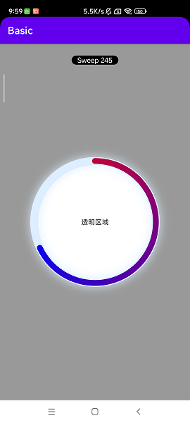

# CircularProgressView

#### 1.1、示例效果


#### 1.2、属性说明
```
    <declare-styleable name="CircularProgressView">
        <!--圆弧进度角度-->
        <attr name="cpvSweepAngle" format="float" />
        <!--背景颜色-->
        <attr name="cpvBackgroundColor" format="color" />
        <!--镂空圆形大小计算标准-->
        <attr name="cpv2RadiusBaseOn" format="enum">
            <enum name="width" value="0" />
            <enum name="height" value="1" />
        </attr>
        <!--镂空圆形直径-->
        <attr name="cpv2Radius" format="dimension" />
        <!--镂空圆形直径占比-->
        <attr name="cpv2RadiusPercent" format="float" />
        <!--镂空圆形布局位置-->
        <attr name="cpv2RadiusGravity" format="enum">
            <enum name="topLeft" value="0" />
            <enum name="topCenter" value="1" />
            <enum name="topRight" value="2" />
            <enum name="center" value="3" />
            <enum name="bottomLeft" value="4" />
            <enum name="bottomCenter" value="5" />
            <enum name="bottomRight" value="6" />
        </attr>
        <!--阴影圆形颜色-->
        <attr name="cpvShadowColor" format="color" />
        <!--阴影圆形线宽-->
        <attr name="cpvShadowStrokeWidth" format="dimension" />
        <!--进度圆形起始颜色-->
        <attr name="cpvProgressStartColor" format="color" />
        <!--进度圆形结束颜色-->
        <attr name="cpvProgressEndColor" format="color" />
        <!--进度圆形线宽-->
        <attr name="cpvProgressStrokeWidth" format="dimension" />
    </declare-styleable>
```

#### 1.3、在xml布局文件添加
```
    <jsc.org.lib.basic.widget.CircularProgressView
        android:id="@+id/cpv_progress"
        android:layout_width="match_parent"
        android:layout_height="match_parent"
        app:cpv2RadiusBaseOn="width"
        app:cpv2RadiusPercent=".6"
        app:cpvBackgroundColor="#80333333"
        app:cpvProgressEndColor="#0000FF"
        app:cpvProgressStartColor="#FF0000" />
       
```

#### 1.4、进度动画
```
CircularProgressView progressView;

progressView.sweepAngle(245, 1_500);

```